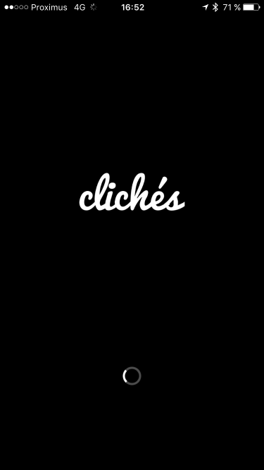
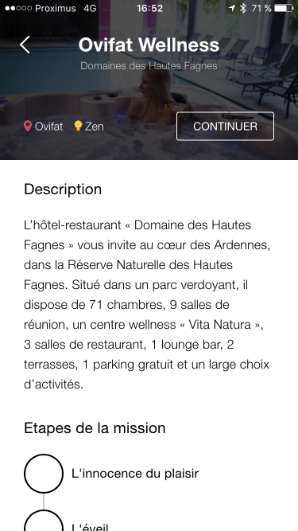

> Ce projet a été réalisé dans le cadre du [Dev Camp 2016](http://www.mic-belgique.be/devcamp) du [Microsoft Innovation Center](http://www.mic-belgique.be/).
>
> Le Dev Camp est un Hackathon Open Source permettant aux développeurs de prototyper gratuitement une application pour des porteurs de projets n'ayant pas forcément les fonds nécessaires à son développement.
> Les projets sont sélectionnés en fonction de leur capacité à être réutilisables par d’autres entreprises Wallonnes.
>
> Le code source est Libre et Open Source (licence MIT).
>
> Vous pouvez suivre le MIC sur [Facebook](https://www.facebook.com/micbelgique), sur [Twitter](https://twitter.com/micbelgique) et aussi suivre nos événements sur [Meetup](www.meetup.com/micbelgique/)

# DevCamp2016-Team3: "A-Team"
**Clichés** is a mobile application that offers exploration missions to photographers. On a map, they are invited to take pictures of various environment items to discover a new place in the world.




## Members
*	David Werbrouck, pixel organizer ([@david_werbrouck](https://twitter.com/david_werbrouck))
*	Sylvain Guerin, byte ruler ([@sguerin_](https://twitter.com/sguerin_))
*	Nicolas Van Eeckhout, business discoverer ([@vaneeckhout](https://twitter.com/vaneeckhout))
*	Fabian Vilers, byte cruncher ([@fvilers](https://twitter.com/fvilers))

## Tech stack
* NodeJS
* Express
* MongoDB
* Angular 2
* HTML 5

## How to run ?
* Start MongoDB
* Start the Back-End server
* Start the Frond-End server
* Open you mobile browser at [http://localhost:3000](http://localhost:3000)

### Back-End
```
cd backend
npm install
npm start
```

### Front-End
```
cd frontend
npm install
git checkout -- app/app.settings.ts
npm start
```

## How to deploy on Heroku ?
```
git remote add heroku-backend https://git.heroku.com/cliches-backend.git
git subtree push --prefix backend heroku-backend master

git remote add heroku-frontend https://git.heroku.com/cliches-frontend.git
git subtree push --prefix frontend heroku-frontend master
```
